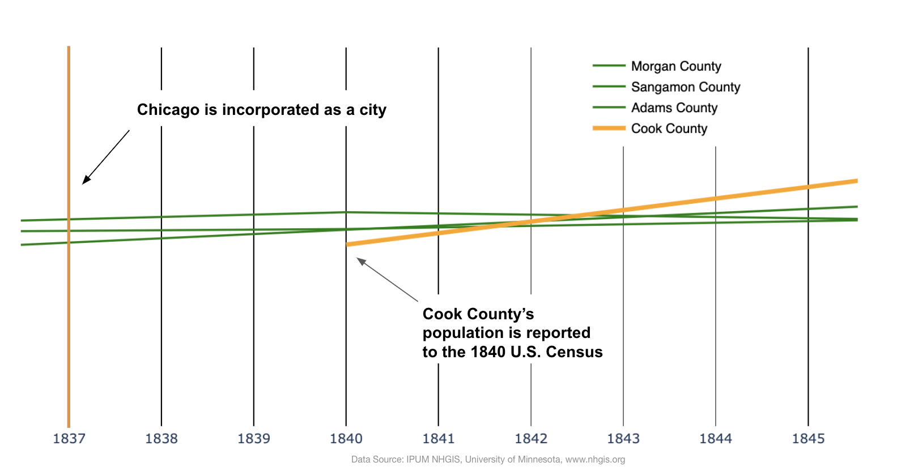
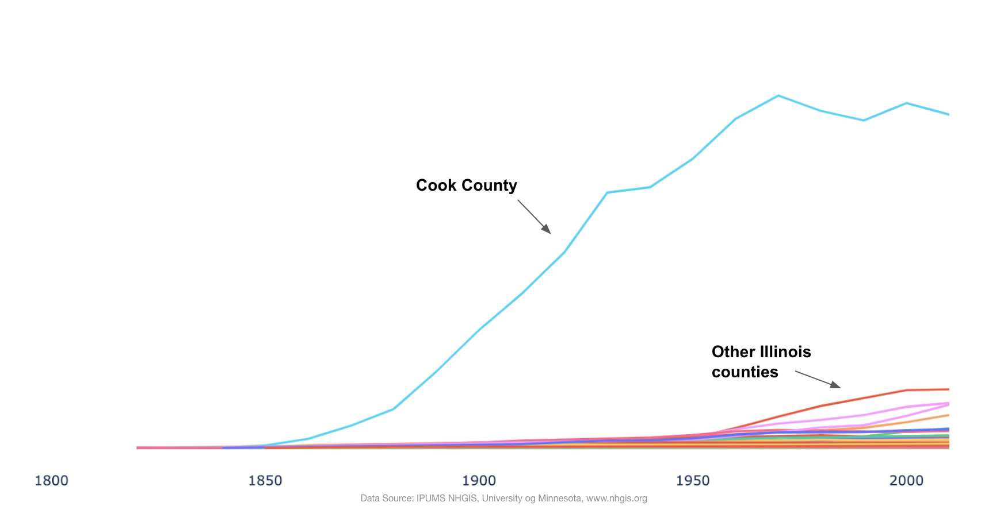
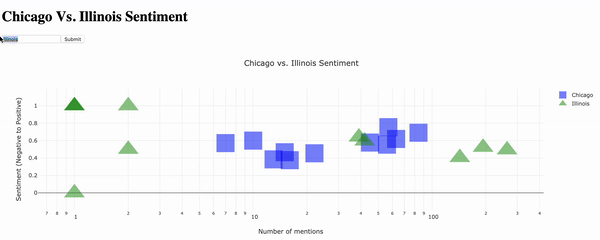
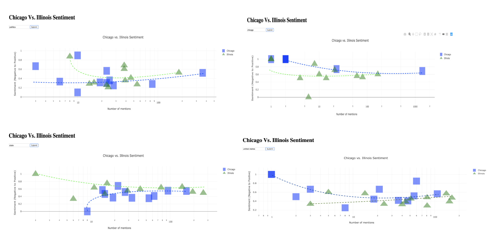
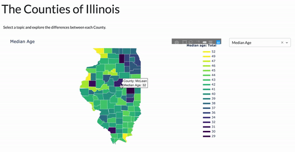

# Introduction
***It's 1840***, Chicago's population has been reported to the US census for the first time, and for a brief moment Cook County, which would grow into the home of the nation's third largest metropolis, has a smaller population than other counties in Illinois.

For the next 130 years, Chicago's population would skyrocket, for many decades earning it the title of the world's fastest growing economy. In 2018, Chicago's population made up 21% of Illinois' and was 13.5 times the population of Aurora––the state's second largest city.

***One month ago***, the Chicago Tribune published a story about [a growing movement](https://www.chicagotribune.com/lifestyles/ct-life-illinois-state-secession-movement-0801-20190801-iesnu74ogvfjxfk35sn72lq7ya-story.html) in Illinois that seeks to seperate the city of Chicago from the rest of the state. The Tribune describes eager Illinoisians packing meeting rooms beyond capacity, and bringing their own chairs, as they discuss why it is important to divide the 21st state of the union. 

The story of how the City of Chicago moved from a blossoming metropolis to an economic superpower, that provokes revulsion in other regions of the state, is a story that is representative of our politics. Rooted in cultural divisions, demonization, ecomonics, and public policy––it is a complex one, and a worthy topic for building investigative tools.

In this project, I use 70,000 tweets from residents of Illinois and data from The U.S. Census to build data visulizations for examining the Chicago-Illinois divide, and for investigating where this divide is rooted in truth, and where in falsehood.

*Note –– All code was written in Python for this project and can be referenced in the file named "propublica-predicting-sentiment.ipynb" within this repository.*

# Twitter Data Methodology

## Predicting Sentiment
To examine the perspectives of both groups, I first used text data from a [1.6 million tweet dataset](https://www.kaggle.com/kazanova/sentiment140) to train a neural network to predict the sentiment of a tweet (whether the tweet is emotionally positive or negative) with about 78% accuracy. 

I then used a [Tweepy streamer](http://docs.tweepy.org/en/v3.4.0/streaming_how_to.html) to collect 70,000 tweets with location data that is either set as "Illinois, USA" or "Chicago, Illinois". After removing [stop words](https://www.computerhope.com/jargon/s/stopword.htm) and [lemmatization](https://nlp.stanford.edu/IR-book/html/htmledition/stemming-and-lemmatization-1.html), I ran the neural network over each tweet from Illinois and predicted the sentiment of every twitter user.

## Word Vectorization
I could create graphs showing the difference in sentiment on specific topics, but this would require that I personally choose the topics worth examining. Because the goal of this project is to get a sense of who the people in Illinois and Chicago are and what they are tweeting about, it is counter intuitive to decide which topics are worthy of investigation.

To get around this, I used [word vectorization](https://blog.theodo.com/2017/09/day-words-became-vectors/) with the [gensim library](https://radimrehurek.com/gensim/models/word2vec.html) to find relationships between every word used by the twitter users –– i.e. If a user is tweeting about guns, what else are they tweeting about?

## Dash Application

I created a dash application that allows a user to search a word and examine the differences between Illinois and Chicago on any given subject: 

The dash application can be found here: http://bit.ly/2lRS88t_hi_propublica_1

The code for the app can be found in the file "illinois-sentiment-app" within this repository

A notable observation that repeatedly appears in this graph: When the number of times a word is mentioned is low, the average sentiment of those words is extremely negative or positive, and often the sentiment of Chicago and the rest of Illinois are opposite of one another. However, as the number of mentions a word receives increases, often the sentiments of both groups converge at the center to form a neutral sentiment. 

- This is somewhat unsurprising, many natural language projects have found that a majority of tweets can be qualified as having a neutral sentiment.
- However, in this project it is perhaps more meaningful to point out that the presence of a neutral tweet (a sentiment score of .5) only occurs if there is divide in sentiment within the groups themselves. 
 
This *trend* of polarized sentiments when a word has fewer mentions and converging sentiments as the number of mentions increases suggest a few things:

1. More data should be collected. Right now on certain topics, the word vectorization is drawing connections to obscure words that receive as little as one mention in a 70,000 tweet dataset. With more data these words that add nothing but noise would disappear.

2. This trend suggests that statistically the sentiments between Chicago and the rest of Illinois on a given topic are more similar than different. There are, however, clusters that occur for each group which suggests that on some issues, there seems to be difference both in the frequency that each group tweets about the topic, and the sentiment they hold towards the topic.

### Future Work:
- More data should be collected to try to weed out the noise of the text and sentiment data.
- Because of the inexact nature of sentiment analysis, other approaches to sentiment should be explored. 
    - The GRU neural network should be further tuned to increase its accuracy
    - Libraries such as Text Blob and vaderSentiment should be used as well
        - Comparing the results of each of the sentiment methods would perhaps present a more accurate representation of sentiment than using a single method. 

### Notes on methodology

*It is worth noting that most Twitter users do not share their location data, but a generalized location is assigned to their account. There is, however, no guarentee that a twitter user with a general location of "Illinois, USA" is not in fact tweeting from Chicago. Perhaps a user signed up for a twitter account while living outside of Chicago and has moved there––something migration trends suggest to be probable––See [Project 2](https://github.com/jayohelee/propublica-il-predicting-population-change). Because of this, there is an inevitable margin of error to this methodology.*

*The [demographics of twitter](https://www.pewinternet.org/2019/04/24/sizing-up-twitter-users/):* 
- *Only about 22% of US citizens are on twitter*
- *About 80% of twitter content is made by 10% of its users*
- *Twitter users are younger than the general public on average.*

*Terribly, tweets were collected over the weekend of August 3-4, 2019 which were the dates of [two consecutive mass shootings](https://www.nytimes.com/2019/08/04/us/mass-shootings-dayton-el-paso.html) in the United States, so topics relating to guns and their politics is likely over represented in the data. (A noticeably better accuracy can be observed with word vectorization on these topics.)*

*Because this project is being shared publicly, all location and user data other than the text has been stripped from the twitter dataset.*

# US Census

I'm a firm believer that sociological investigation should always include some form of outreach to the public, so the language and sentiment work above are valuable to this project and should be expanded. However, from a policy perspective tabular census data is perhaps more effective for examining differences such as diversity, income, unemployment, etc. 

For this reason, I have also created an application that allows a user to select demographic, economic, and education topics to examine the difference between each county in the form of a choropleth map. 

The dash application can be found here: http://bit.ly/2kn8Pbj_hi_propublica2

The code for the app can be found in the file "choropleths-app" within this repository.

## Choropleth Data 
Census data was collected using the [Ipums tool](https://www.nhgis.org/) 

Because of the large population difference between Chicago and the rest of the state, meaningful information can only be examined using choropleths if data is scaled percapita. This data manipulation was done using pandas.

